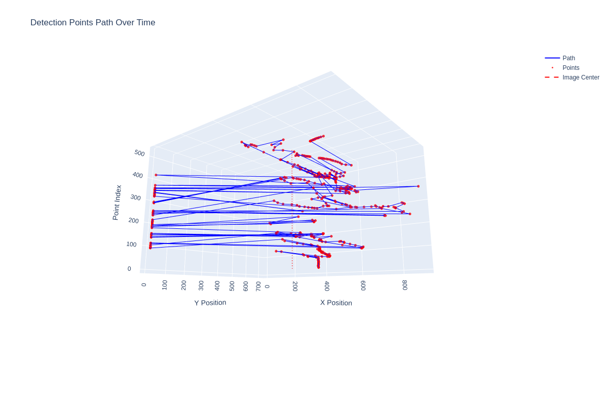
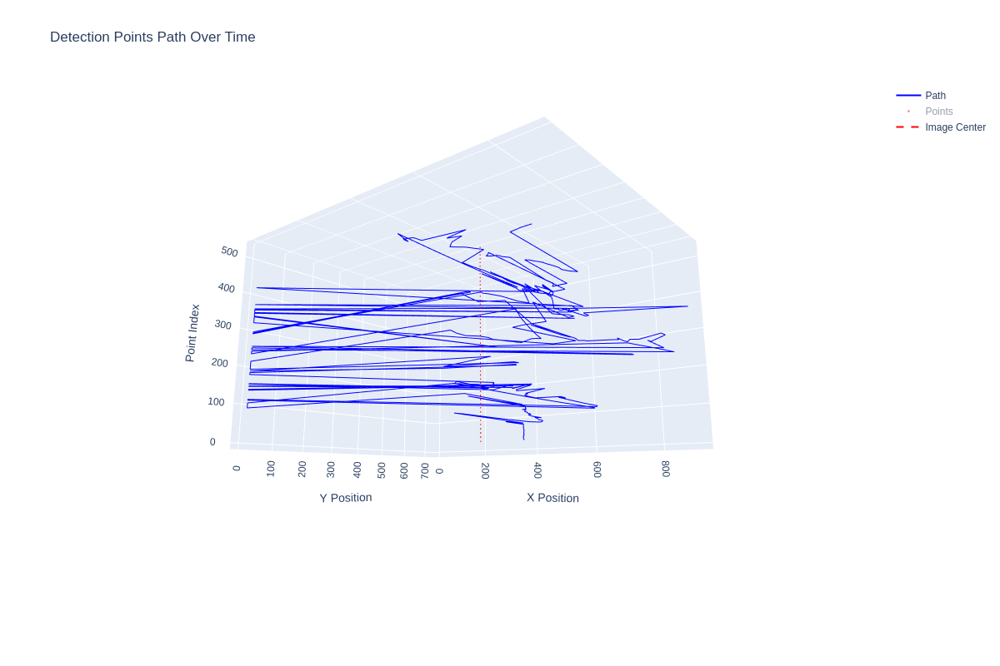
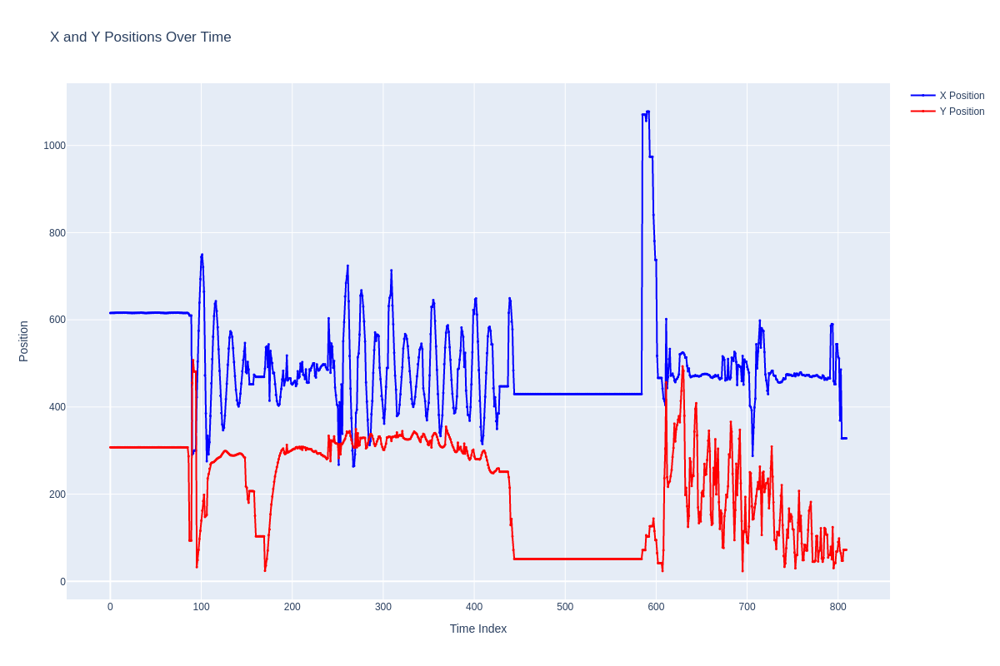

# RMUA 2025 Drone System

## Overview
Autonomous drone system for RMUA 2025 competition, featuring navigation, vision, and control capabilities.

## Problems
- need to deal the problem of the yolo position's noise
- trying to use weighted average, and Kalman fliter to deal with the noise
- but the weighted average might not be a good way because of the yolo results' jump noise, so use fliter windows and mean to deal with it
- and using Kalmen fliter to smooth the position and predict the next position
- after fliter, the need problem is to fix the problem of the drone's pwm control logic, maybe the z axis's control logic is not correct and the z axis's pwm should not really basic on the position, should make it more smooth and not change so up and down
- as the same time, also need to consider the problem of the car's position, need to make the filtered position to detect if the car will stop drone, if drone, may need to quickly recalculate the position and make the drone to escape the car

### without flitered result image



### using windows fliter result image



## Packages
- `airsim_ros`: AirSim ROS interface
- `navigation`: Core navigation package
- `navigation_vision`: Vision-based navigation
- `drone_control`: Drone control system 

## Quick Start
```bash
# Launch navigation system
roslaunch navigation navigation_tf.launch

# Launch vision system
roslaunch navigation_vision vision.launch

# Launch drone control
roslaunch navigation drone_control.launch

# Launch yolo detect
roslaunch navigation_vision yolo_detect.launch
```

## Dependencies
- ROS Noetic
- OpenCV
- PCL
- Eigen

## Contact
- Email: 3133824384@qq.com
- GitHub: Yoasobisong